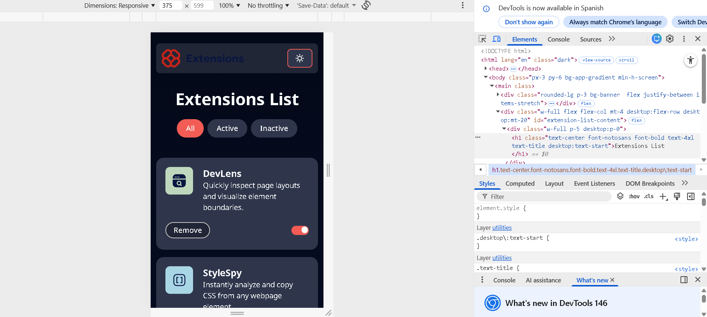
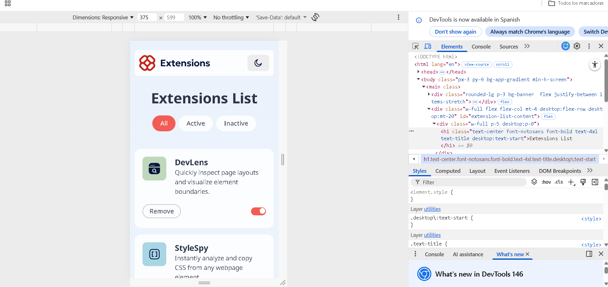

# Frontend Mentor - Browser extensions manager UI solution


This is a solution to the [Browser extensions manager UI challenge on Frontend Mentor](https://www.frontendmentor.io/challenges/browser-extension-manager-ui-yNZnOfsMAp). Frontend Mentor challenges help you improve your coding skills by building realistic projects.

## Table of contents

- [Overview](#overview)
  - [The challenge](#the-challenge)
  - [Screenshot](#screenshot)
  - [Links](#links)
- [My process](#my-process)
  - [Built with](#built-with)
  - [What I learned](#what-i-learned)
  - [Continued development](#continued-development)
  - [Useful resources](#useful-resources)
  - [AI Collaboration](#ai-collaboration)
- [Author](#author)
- [Acknowledgments](#acknowledgments)

**Note: Delete this note and update the table of contents based on what sections you keep.**

## Overview

### The challenge

Users should be able to:

- Toggle extensions between active and inactive states
- Filter active and inactive extensions
- Remove extensions from the list
- Select their color theme
- View the optimal layout for the interface depending on their device's screen size
- See hover and focus states for all interactive elements on the page

### Screenshot




### Links

- Solution URL: [Add solution URL here](https://your-solution-url.com)
- Live Site URL: [Add live site URL here](https://your-live-site-url.com)

## My process

### Built with

- Semantic HTML5 markup
- CSS custom properties
- Flexbox
- CSS Grid
- Mobile-first workflow
- [Vite](https://vite.dev/) - development tool

### What I learned

I learned the content switcher pattern, how to configure Tailwind CSS v4 typography, breakpoints, colors and gradients, and dark mode

```css
@import "tailwindcss";

@utility bg-gradient-light {
  background: var(--gradient-light);
}

@utility bg-gradient-dark {
  background: var(--gradient-dark);
}

@theme {
  --color-Neutral-900: hsl(227, 75%, 14%);
  --color-Neutral-800: hsl(226, 25%, 17%);
  --color-Neutral-700: hsl(225, 23%, 24%);
  --color-Neutral-600: hsl(226, 11%, 37%);
  --color-Neutral-300: hsl(0, 0%, 78%);
  --color-Neutral-200: hsl(217, 61%, 90%);
  --color-Neutral-100: hsl(0, 0%, 93%);
  --color-Neutral-0: hsl(200, 60%, 99%);

  --color-Red-400: hsl(3, 86%, 64%);
  --color-Red-500: hsl(3, 71%, 56%);
  --color-Red-700: hsl(3, 77%, 44%);

  --gradient-bg: linear-gradient(180deg, #ebf2fc 0%, #eef8f9 100%);
  --color-banner: hsl(200, 60%, 99%);
  --color-text: hsl(226, 11%, 37%);
  --color-title: hsl(225, 23%, 24%);
  --color-card: hsl(200, 60%, 99%);
  --color-buttonicon: hsl(0, 0%, 93%);
  --color-buttonRemove: hsl(200, 60%, 99%);
  --color-button-state: hsl(200, 60%, 99%);

  --breakpoint-desktop: 1440px;

  --font-notosans: "Noto Sans", sans-serif;
}

.dark {
  --gradient-bg: linear-gradient(180deg, #040918 0%, #091540 100%);
  --color-banner: hsl(226, 25%, 17%);
  --color-title: hsl(200, 60%, 99%);
  --color-text: hsl(200, 60%, 99%);
  --color-card: hsl(225, 23%, 24%);
  --color-buttonicon: hsl(225, 23%, 24%);
  --color-buttonRemove: hsl(226, 25%, 17%);
  --color-button-state: hsl(225, 23%, 24%);
}

.active {
  background-color: hsl(3, 86%, 64%);
  color: hsl(200, 60%, 99%);
}
.active:focus {
  outline: 2px hsl(3, 86%, 64%) solid;
}

@utility bg-app-gradient {
  background: var(--gradient-bg);
  background-repeat: no-repeat;
  background-size: cover;
}
```

### Continued development

- full stack technologies

### Useful resources

- [Example resource 1](https://www.w3schools.com/howto/howto_css_switch.asp) - This resource helped me review how to create the HTML switch element

**Note: Delete this note and replace the list above with resources that helped you during the challenge. These could come in handy for anyone viewing your solution or for yourself when you look back on this project in the future.**

### AI Collaboration

Describe how you used AI tools (if any) during this project. This helps demonstrate your ability to work effectively with AI assistants.

- What tools did you use (e.g., ChatGPT, Claude, GitHub Copilot)?
- How did you use them (e.g., debugging, generating boilerplate, brainstorming solutions)?
- What worked well? What didn't?
- How to configure Tailwind v4 in a Vite project using JavaScript and TypeScript
- Correct way to use a gradient in Tailwind v4
- UI pattern Content Switcher
- Adapt the code of the switch element to tailwindcss
- How to use darkmode in Tailwind CSS v4
- How to configure breakpoints in Tailwind CSS v4

**Note: Delete this note and the content above if you didn't use AI, or replace with your own experience.**

## Author

- Website - [Rinel iñiguez sosa portfolio](https://rineliniguezsosa.github.io/Portafolio/)
- Frontend Mentor - [@rineliniguezsosa](https://www.frontendmentor.io/profile/rineliniguezsosa)
- Linkedin - [Rinel iñiguez](https://www.linkedin.com/in/rinel-iniguez/)

**Note: Delete this note and add/remove/edit lines above based on what links you'd like to share.**

## Acknowledgments

This is where you can give a hat tip to anyone who helped you out on this project. Perhaps you worked in a team or got some inspiration from someone else's solution. This is the perfect place to give them some credit.

**Note: Delete this note and edit this section's content as necessary. If you completed this challenge by yourself, feel free to delete this section entirely.**
